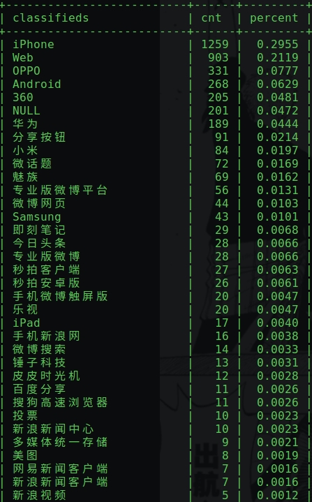

# Analytic Sketch OF Weibo 

## capture real-time hot keywords of weibo
target url is "http://s.weibo.com/top/summary?cate=realtimehot".
weibo_realtimehot.py

- dev done, `html embed in js, get raw js, use RE capture raw html in js, re-parse html with bs4`
- test done, crontab string
    ```
    0 * * * * python3 ~/project/github/weibo_analytics/weibo_realtimehot.py >>/tmp/weibo_realtimehot.log 2>&1
    ```

## utilize weibo web API
[search/topics 搜索某一话题下的微博](http://open.weibo.com/wiki/2/search/topics)
search/topics
搜索某一话题下的微博,capture with keywords

访问级别：高级接口（需要授权）
I have to give up this since this API is senior interface of weibo which need to apply

Instead, use [selenium_weibo_crawler.py](https://github.com/genghuiluo/legacy/blob/master/crawler_sample/selenium_weibo_crawler.py) as sample

weibo_search.py

## step3: hygiene weibos' device
device.sql

## step4: generate a static page(dashboard) in jekyll
so far, need more data...



